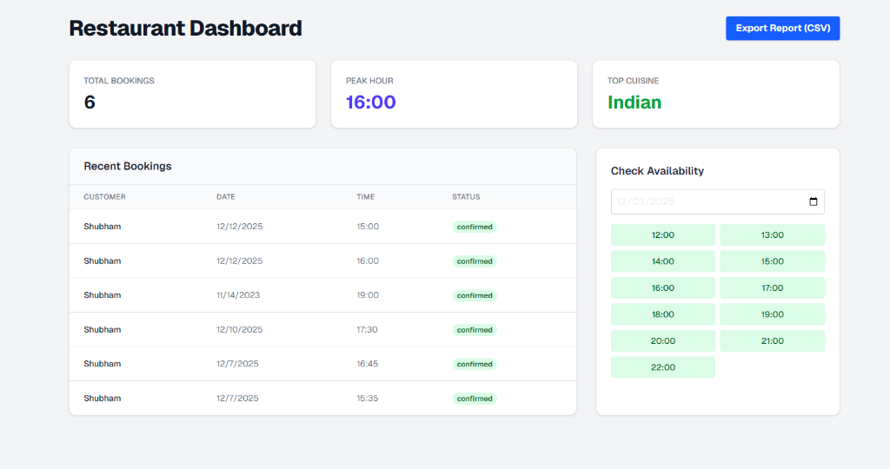

# Vaiu Voice Agent - AI Voice Restaurant Booking Agent 🎙️🍽️

**Vaiu Voice Agent** is an intelligent voice-enabled AI agent that allows users to book restaurant tables through natural conversation. Built with the **MERN Stack** and **LiveKit**, it features real-time voice interaction, weather-based seating suggestions, and multi-language support (English & Hindi).



## 🚀 Features

### Core Requirements (Completed ✅)
*   **Voice Interaction:** Real-time Speech-to-Text (STT) and Text-to-Speech (TTS) using **LiveKit** and **OpenAI**.
*   **Natural Conversation:** Handles booking details (Name, Guests, Date, Time, Cuisine) naturally.
*   **Backend API:** robust Node.js/Express REST API for managing bookings.
*   **Database:** MongoDB (Atlas) integration for persistent storage.
*   **Weather Integration:** Automatically fetches weather for the booking date (via OpenWeatherMap) and suggests **Indoor vs. Outdoor** seating.

### Bonus Features (All Implemented 🌟)
1.  **Natural Language Processing:** Powered by **GPT-4o-mini** for intelligent intent understanding.
2.  **Multi-language Support:** Fully supports **Hindi** and **English** voice commands with code-switching.
3.  **Calendar Integration:** Visual availability checker in the dashboard to prevent double bookings.
4.  **Notifications:** Sends real **SMS (Twilio)** and **Email (Nodemailer)** confirmations upon successful booking.
5.  **Admin Dashboard:**
    *   Real-time booking list.
    *   **Analytics:** Peak hours, popular cuisines, total bookings.
    *   **Export:** Download booking data as CSV.

---

## 🛠️ Tech Stack

*   **Frontend:** Next.js 14, Tailwind CSS, Lucide React
*   **Backend:** Node.js, Express.js
*   **Database:** MongoDB Atlas
*   **AI & Voice:** LiveKit Agents, OpenAI (GPT-4o-mini)
*   **Services:** Twilio (SMS), Nodemailer (Email), OpenWeatherMap (Weather)

---

## 📂 Project Structure

```bash
Vaiu-Voice-Agent/
├── agent/              # AI Voice Agent (LiveKit + OpenAI)
│   ├── agent.js        # Main agent logic & prompt
│   └── tools.js        # Tools for Weather & Booking API
├── server/             # Backend API (Express + MongoDB)
│   ├── models/         # Mongoose Schemas
│   ├── routes/         # API Routes (Bookings, Weather)
│   └── services/       # Notification Services (Email/SMS)
└── web/                # Frontend Dashboard (Next.js)
    ├── app/dashboard/  # Admin Dashboard & Analytics
    └── app/page.tsx    # Voice Interface
```

---

## ⚙️ Setup Instructions

### 1. Prerequisites
*   Node.js (v18+)
*   MongoDB Atlas URI
*   LiveKit Cloud Project
*   OpenAI API Key
*   Twilio Account (for SMS)
*   Gmail App Password (for Email)

### 2. Environment Variables
Create a `.env` file in the root directory:

```env
# MongoDB
MONGODB_URI=your_mongodb_connection_string

# Server
PORT=3001
SERVER_URL=http://localhost:3001

# Weather (OpenWeatherMap)
OPENWEATHER_API_KEY=your_weather_api_key

# LiveKit
LIVEKIT_URL=your_livekit_url
LIVEKIT_API_KEY=your_livekit_key
LIVEKIT_API_SECRET=your_livekit_secret

# OpenAI
OPENAI_API_KEY=your_openai_key

# Notifications
EMAIL_USER=your_email@gmail.com
EMAIL_PASS=your_gmail_app_password
TWILIO_ACCOUNT_SID=your_twilio_sid
TWILIO_AUTH_TOKEN=your_twilio_token
TWILIO_PHONE_NUMBER=your_twilio_phone
ADMIN_PHONE=your_personal_phone_number
```

### 3. Installation & Running

**1. Backend Server**
```bash
cd server
npm install
node index.js
# Runs on http://localhost:3001
```

**2. Voice Agent**
```bash
cd agent
npm install
node agent.js
# Connects to LiveKit room
```

**3. Frontend Client**
```bash
cd web
npm install
npm run dev
# Opens at http://localhost:3000
```

---

## 🧪 API Endpoints

| Method | Endpoint | Description |
| :--- | :--- | :--- |
| `GET` | `/api/bookings` | Get all bookings |
| `POST` | `/api/bookings` | Create a new booking |
| `DELETE` | `/api/bookings/:id` | Cancel a booking |
| `GET` | `/api/weather` | Get weather forecast |

---

## 📸 Usage

1.  Open the **Web Client** (`localhost:3000`).
2.  Click **"Start Talking"**.
3.  Say: *"I want to book a table for 2 people tomorrow at 7 PM."*
4.  The agent will check the weather ☀️ and suggest seating.
5.  Confirm the details.
6.  Check your **Phone/Email** for the confirmation! 📱
7.  Visit the **Dashboard** (`localhost:3000/dashboard`) to see analytics.

---

**Submitted by:** Vinit Kumar
